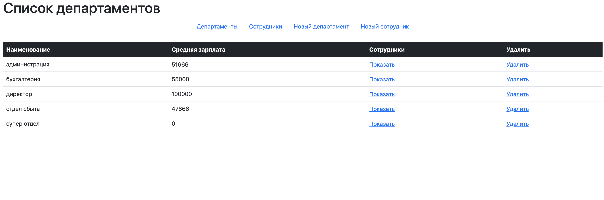
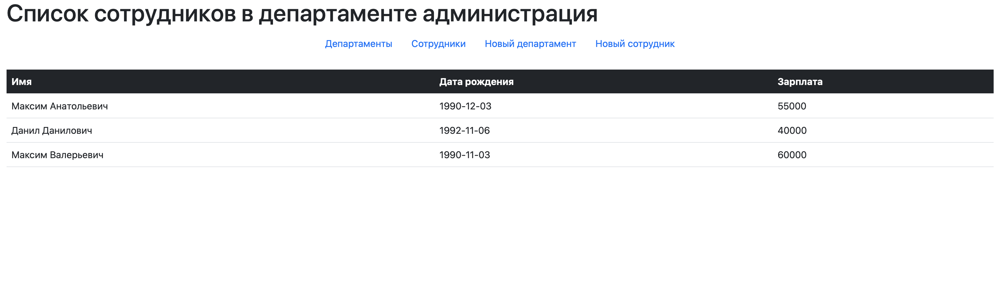
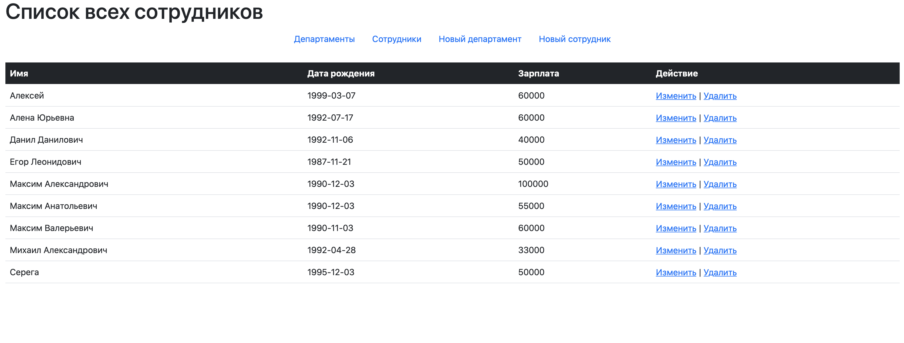
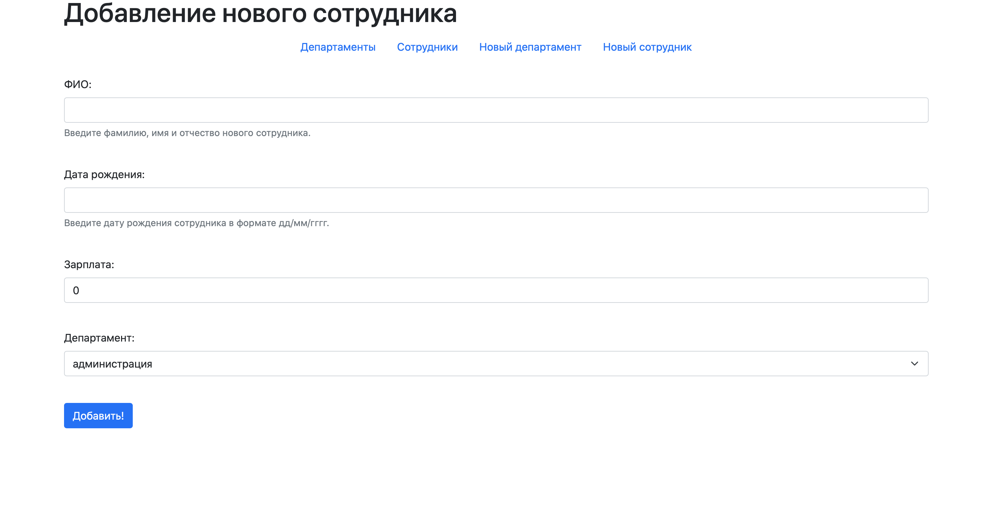

# DepartmentApp
Application for accounting of employees in departments. You can add, remove departments and update employees. On the list of departments, you can see the average salary for department employees.

